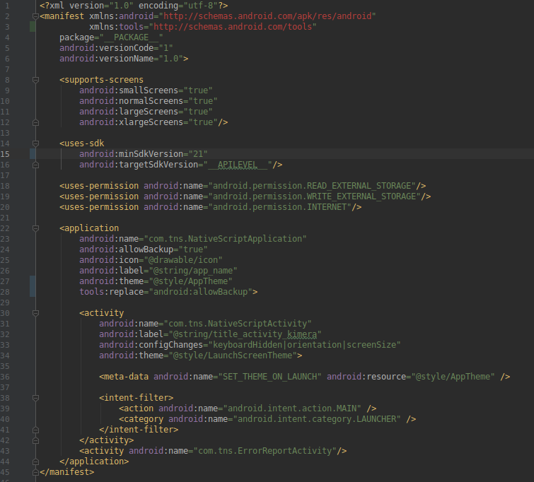

<a align="center" href="https://www.npmjs.com/package/@nstudio/nativescript-xavier-passport">
    <h3 align="center">NativeScript Xavier Passport</h3>
</a>
<h4 align="center">NativeScript plugin to scan MRZ data from Passports and Cards for Android and iOS.</h4>

<p align="center">
    <a href="https://www.npmjs.com/package/@nstudio/nativescript-xavier-passport">
        
    </a>
    <a href="https://www.npmjs.com/package/@nstudio/nativescript-xavier-passport">
        
    </a>
    <a href="https://github.com/nstudio/nativescript-xavier-passport/stargazers">
        
    </a>
     <a href="https://github.com/nstudio/nativescript-xavier-passport/network">
        
    </a>
    <a href="https://github.com/nstudio/nativescript-xavier-passport/blob/master/LICENSE.md">
        
    </a>
</p>

<p align="center">
    <a align="center" href="https://nstudio.io">
      
    </a>
    <h5 align="center">Do you need assistance on your project or plugin? Contact the nStudio team anytime at <a href="mailto:team@nstudio.io">team@nstudio.io</a> to get up to speed with the best practices in mobile and web app development.
    </h5>
</p>

---


# NativeScript Xavier-Passport

This is a NativeScript cross platform plugin wrapping the Black Shark Tech Xavier library for IOS and Android.

## License

Our code is 2018-2019, nStudio, LLC.  Everything is LICENSED under the APACHE 2.0 License, meaning you are free to include this in any type of program.  

However, the base Xavier library must be licensed from them see: 
https://github.com/BlackSharkTech/Xavier-demo-android
and 
https://github.com/BlackSharkTech/Xavier-demo-ios
To get a real license key you need to contact sales @ blacksharktech.com


## Installation 
Same plugin works on NativeScript 5.x and above

Run `tns plugin add @nstudio/nativescript-xavier-passport` in your ROOT directory of your project.

## Android Required Setup
In your app/App_Resources/Android/src/main/res/AndroidManifest.xml you need to do the following:
1. Add `xmlns:tools="http://schemas.android.com/tools"` to the `<Manifest ...`
2. In the `<uses-sdk` change the android:minSdkVersion="XX" to at least 21.
3. Int the `<application` add `tools:replace="android:allowBackup"`  



## Usage

### Start Scanning
```js
const Passport = require('@nstudio/nativescript-xavier-passport');

const zp = new Passport({"licenseKey": "<LICENSE_KEY>"});
zp.on("results", function(results) { console.log("Results:", results); });
zp.start();

```


### Instantiating the Passport Object
#### new Password(options)
#### Options:
- licenseKey = Your license key (Can be any string for Testing!)
- boundingBoxSearchingColor =  Color of the bounding box
- boundingBoxFoundColor = Color of the bounding box when found
- closeButtonColor = Close button color
- flashOnButtonColor = Flash on button color
- flashOffButtonColor = Flash off button color
- flashButtonEnabled = (true/false) Display the flash button
- instructionTextEnabled = (true/false) Display instructional text in camera 
- instructionText = Text to display
- instructionTextColor = Text color
- instructionTextFont = Font to use
- cameraNegativeSpaceBackgroundEnabled = Background space 
- cameraNegativeSpaceBackgroundColor = Background color


### .enableDebug()
Will enable more logs to be output to the log system.

### .enableCloseHack()
Might be required for iOS; last version of MRZ had issue with notification of closing; so we have a work around...

### .start()
```js
zp.start();
```
Start the scanning

### Events
```js
zp.on("error", function(error) { console.log("Error", error); });
zp.on("closed", function() { console.log("Closed the reader"); });
zp.on("results", function(results) { console.log("Results", results); });
```

- `results` - Will give you an object with keys for everything including the raw data as the "rawMrz" key.
- `error`   - Will give you the error message from Xavier or if your results or close event code is buggy then the error from your code will be also passed back via this callback.
- `closed`  - Will be triggered when it closes the scanning screen. (on iOS this is triggered several times)  
 
### Result Object:
documentImage - The image of the identity; this is either a native iOS image or Android Bitmap.

documentType - The document type.

countryCitizen - The code of the country/nationality of identity

givenName - The given/first name of the identity.

surname - The surname/last/family name

documentNumber - The document number identity.

countryIssue - The issuing country code

dateBirth - Date of Birth; Returned in YYMMDD format

sex - gender of identity.

dateExpiration - Expiration date of identity in YYMMDD format

optionalData - The optional data for a second line in a MRZ

optionalData2 - The optional data for a thrid line in a MRZ

stateIssue - Issuing state

rawMrz - The unparsed MRZ read

documentNumberCheckDigit - The check digit for the document number.

dateBirthCheckDigit - The check digit for the date of birth

dateExpirationCheckDigit - The check digit for the expiration date.

optionalDataCheckDigit - The check digit for the optional data

compositeCheckDigit - The check digit over the document number, birth date, expiration date, optional data, and their check digits
                      


## Demo
 
 Please see the demo source (See: main-view-model.js).
   
