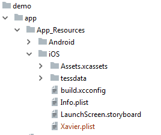
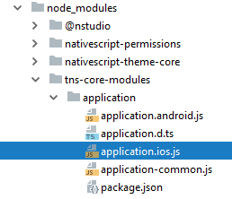
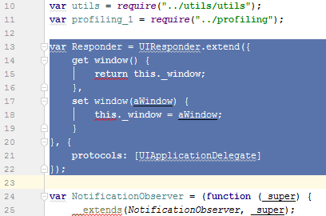

[](https://www.npmjs.com/package/@nstudio/nativescript-xavier-passport)
[](https://www.npmjs.com/package/@nstudio/nativescript-xavier-passport)
[](https://www.npmjs.com/package/@nstudio/nativescript-xavier-passport)

# NativeScript Xavier-Passport

This is a NativeScript cross platform plugin wrapping the Xavier Passport library for IOS and Android.

## License

Our code is 2018, nStudio, LLC.  Everything is LICENSED under the APACHE 2.0 License, meaning you are free to include this in any type of program.  
However, the base Xavier library must be licensed from them. 
https://github.com/BlackSharkTech/Xavier-Passport-MRZ-OCR-Android-Eval-SDK
and 
https://github.com/BlackSharkTech/Xavier-Passport-MRZ-OCR-iOS-Eval-SDK


## Installation 
Same plugin works on  NativeScript 2.x - 4.x

Run `tns plugin add @nstudio/nativescript-xavier-passport` in your ROOT directory of your project.

## Android Required Setup
None

## iOS Required Setup
On iOS you need to do a couple things to make everything work correctly.
1. You need to copy the `tessdata` folder into your `app/App_Resources/iOS` folder. 
2. You also need to copy the `Xavier.plist` into your `app/App_Resource/iOS` folder. 


3. You need to edit the `Xavier.plist` file and add your license and email address and change any other options you might want/need to change.
4. You need to edit the `node_modules/tns-core-modules/application/application.ios.js` file.

   
And replace the entire `Responder` class with this new class code:
```js
var Responder = UIResponder.extend({
    get window() {
        return this._window;
    },
    set window(aWindow) {
        this._window = aWindow;
    }
}, {
    protocols: [UIApplicationDelegate]
});
```  
So it should when done look like this:




## Usage

### Start Scanning
```js
var Passport = require('nativescript-xavier-passport');

var zp = new Passport({"license key":"<LICENSE_KEY>", "email address": "<EMAIL_ADDRESS>"});
zp.on("results", function(results) { console.log("Results:", results); });
zp.start();

```

### Enable more debugging
```
zp.enableDebugging()
``` 
Will enable more logs to be output to the log system.


### Events
```js
zp.on("error", function(error) { console.log("Error", error); });
zp.on("closed", function() { console.log("Closed the reader"); });
zp.on("results", function(results) { console.log("Results", results); });
```

- `results` - Will give you an object with keys for everything including the raw data as the "raw" key.
- `error`   - Will give you the error message from Xavier or if your results or close event code is buggy then the error from your code will be also passed back via this callback.
- `closed`  - Will be triggered when it closes the scanning screen. (on iOS this is triggered several times)  
 
## Demo
 
 Please see the demo source.
   
